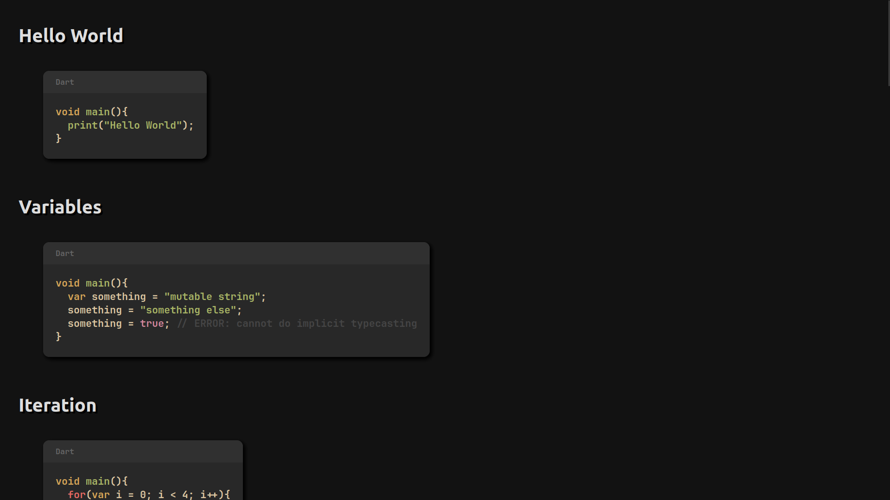
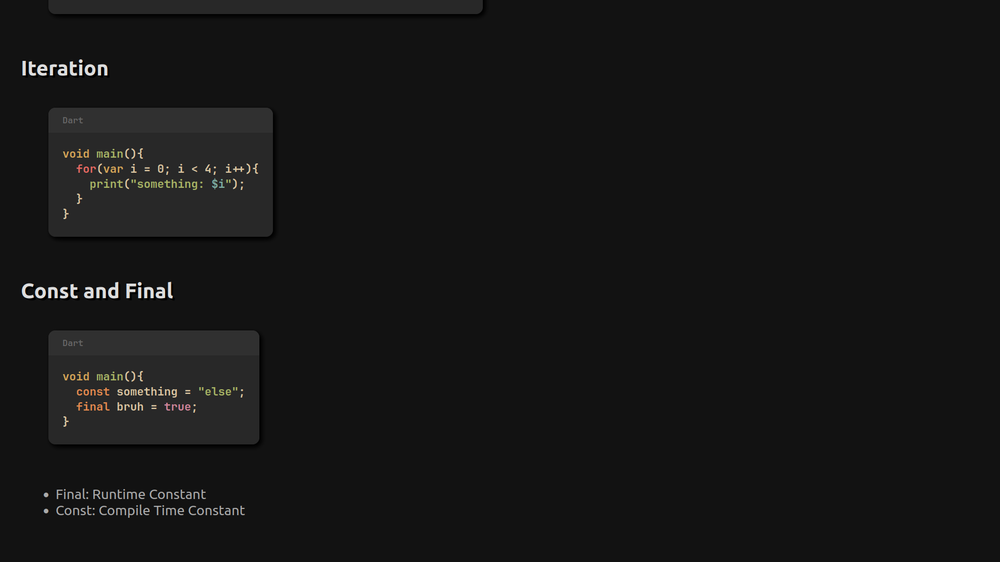
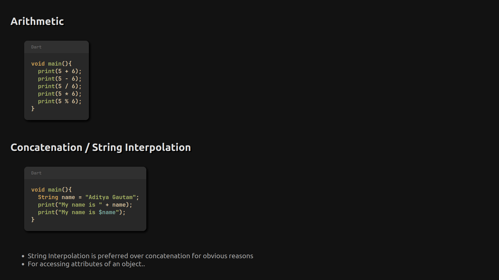
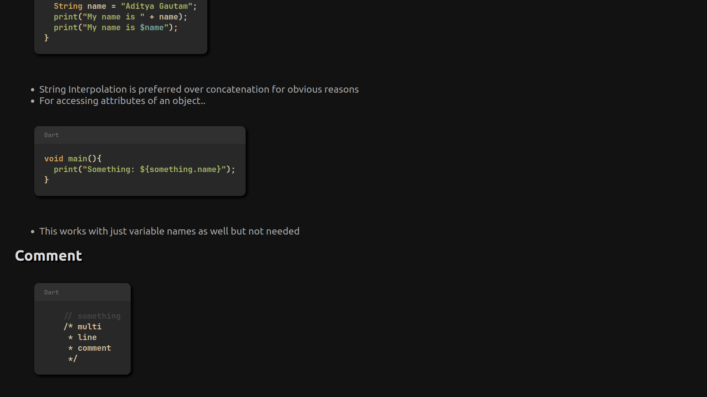
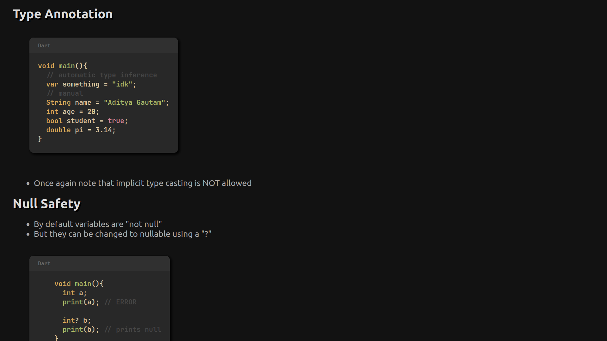
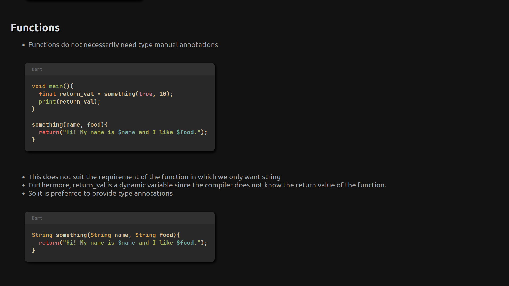

# Dart Tutorial

## How to Use?

```
$ git clone https://github.com/aditya23043/Dart_Tutorial
$ cd Dart_Tutorial
$ pwd | xclip -i -sel clipboard
<C-v> in a browser and add /index.html to the URL
```

## Screenshots







